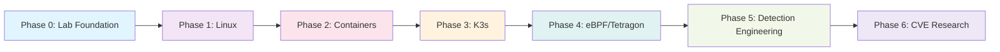

# Tetragon Lab Architecture

## Current Architecture

The current lab setup is a single, lightweight physical Ubuntu Server 24.04 LTS machine configured with GUI and development tooling.

```
Development Workstation
    ↓
[GitHub Repository & Documentation]
    ↓
Dedicated Ubuntu Lab Machine (24.04 LTS)
    ↓
[Linux Experiments & Observations]
```

**Why a single, dedicated lab machine?**

- **Simplicity and focus**: A lightweight VM or physical machine is sufficient for initial Linux runtime security exploration
- **Affordability**: Keeps lab infrastructure lean
- **Learning progression**: Allows deep understanding of single-node fundamentals before adding complexity (containers, multi-node Kubernetes)
- **Reproducibility**: Easier to track state and document exact conditions
- **Clear separation**: Distinguishes between documentation environment (workstation) and experiment environment (lab)

The development workstation maintains the repository and documentation; the lab machine is the actual experimental environment where runtime security observations occur.

## Current Architecture Diagram

```
┌─────────────────────────────────────┐
│   Development Workstation           │
│   ┌─────────────────────────────┐   │
│   │  GitHub Repository          │   │
│   │  Documentation              │   │
│   │  (Markdown, Architecture)   │   │
│   └─────────────────────────────┘   │
└──────────────────┬──────────────────┘
                   │
                   │ (Sync / Document)
                   │
┌──────────────────▼──────────────────┐
│   Ubuntu Lab Machine (24.04 LTS)    │
│   ┌─────────────────────────────┐   │
│   │  Linux Runtime Environment  │   │
│   │  - Kernel & syscalls        │   │
│   │  - Processes & signals      │   │
│   │  - eBPF readiness           │   │
│   │  - Experimental tools       │   │
│   └─────────────────────────────┘   │
└─────────────────────────────────────┘
```

## Planned Evolution

Over time, the lab will expand to include:

1. **Phase 1: Linux Fundamentals**
   - Process model, syscall tracing
   - /proc filesystem exploration
   - strace and perf instrumentation

2. **Phase 2: Container Runtime**
   - Docker or containerd setup
   - Container syscall interception
   - Container isolation mechanisms

3. **Phase 3: Kubernetes**
   - Single-node K3s deployment
   - Pod networking and isolation
   - Workload observation

4. **Phase 4: eBPF & Tetragon**
   - eBPF program development
   - Cilium Tetragon deployment
   - Runtime event collection

5. **Phase 5: Detection Engineering**
   - Threat model mapping (MITRE ATT&CK)
   - Detection rule design
   - False-positive tuning

6. **Phase 6: CVE-Driven Research**
   - Vulnerability analysis
   - Runtime behaviour capture
   - Detection validation

## Conceptual Security Observation Path

From application to kernel-level detection:

```
Application Code
    ↓
Container Runtime
    ↓
Kubernetes Pod / Orchestration
    ↓
Linux Process Model
    ↓
Linux Kernel Syscalls
    ↓
eBPF Programs / Tetragon Hooks
    ↓
Runtime Security Events & Enforcement
```

As we progress through phases, we will observe how application and container behaviour manifests as observable events at each layer, and ultimately as Tetragon runtime security signals.

## Architecture Evolution Diagram



## Rationale: Single Machine Over Multi-Node

- **Cognitive load**: Multi-node complexity defers fundamental Linux understanding
- **Cost**: A single lab machine has minimal infrastructure overhead
- **Clarity**: Isolated experiments are easier to reason about and reproduce
- **Progression**: Single-node mastery informs later cluster design decisions
- **Scalability**: When we eventually add containers and K3s, the underlying Linux knowledge remains the foundation

The goal is deep, reproducible understanding—not infrastructure scale.
