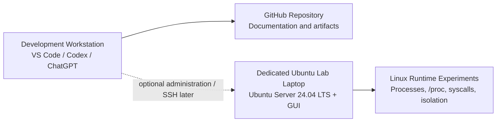
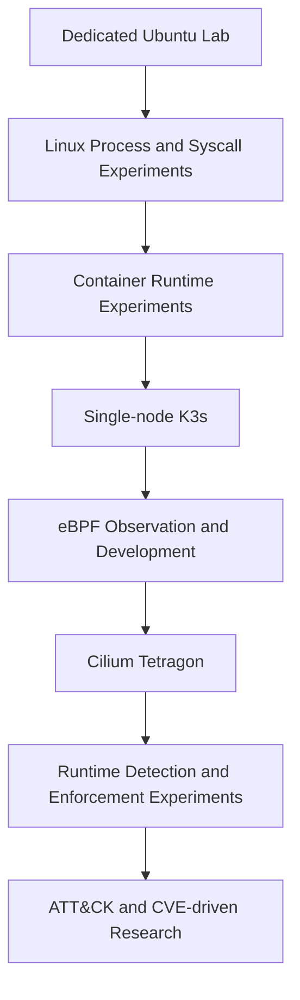
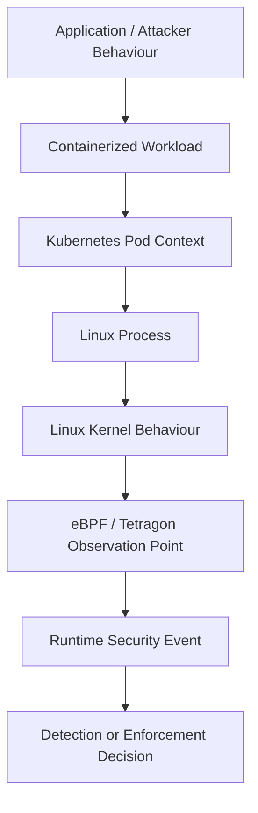

# Tetragon Lab Architecture

## Current Architecture

The project currently uses two separate physical systems with different responsibilities:

- **Development workstation** — GitHub repository, VS Code/Codex workflow, ChatGPT, and polished documentation.
- **Dedicated Ubuntu lab laptop** — Ubuntu Server 24.04 LTS with a GUI installed afterwards; this is where Linux runtime experiments and observations are performed.

```text
Development Workstation
    │
    │ repository / documentation workflow
    ▼
GitHub

Dedicated Ubuntu Lab Laptop
    │
    └── Linux runtime experiments and observations
```

The two systems are intentionally separate. The repository documents the lab, but the development workstation is **not** the runtime-security target being studied.

## Current Architecture Diagram



### Why a Dedicated Single-Machine Lab?

- **Focus:** Linux behaviour can be studied without Kubernetes infrastructure becoming the first problem to solve.
- **Isolation:** Experimental changes remain separate from the primary workstation.
- **Reproducibility:** Fewer moving parts make observations easier to repeat and explain.
- **Resource efficiency:** A single physical host is sufficient for the planned single-node environment.
- **Progression:** Containers, Kubernetes, eBPF, and Tetragon are added only when the relevant underlying concepts are established.

## Planned Evolution

The lab will grow progressively rather than being built as a complete security stack on day one.



The exact tooling at each layer will be introduced only when it supports a specific learning or detection objective.

## Conceptual Security Observation Path

A central question for the project is how high-level application or attacker behaviour becomes observable at lower layers of the system.

The conceptual path we will investigate is:



This diagram is **conceptual**, not a claim that every layer is already deployed in Phase 0. At the current stage, only the Ubuntu lab and Linux-level exploration exist.

## Architecture Principles

### Current State Must Match Reality

Architecture diagrams distinguish between what is deployed today and what is planned. Future Kubernetes, eBPF, or Tetragon components should not appear as current infrastructure before they actually exist.

### Build Complexity Only When It Teaches Something

The goal is not to construct the largest possible homelab. Each additional component should answer a technical question or enable an experiment that cannot be performed cleanly at the current layer.

### Preserve Reproducibility

When architecture changes affect experimental results, the relevant configuration and version information should be recorded alongside the experiment or environment documentation.

### Separate Raw Learning from Public Artifacts

Raw notes, questions, failed assumptions, and resource links remain in Notion. GitHub contains reproducible experiments, validated observations, and polished technical documentation.
